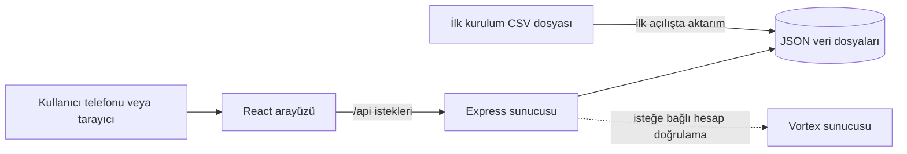

# BlokTakip

<p align="center">
	
</p>

<p align="center">
	Site araç plakalarını aramak ve yetkili filo kayıtlarını yönetmek için mobil uyumlu web uygulaması.
</p>

<p align="center">
	<a href="#kurulum">Kurulum</a> ·
	<a href="#nasıl-çalışır">Nasıl çalışır?</a> ·
	<a href="#son-kullanıcı-rehberi">Son kullanıcı rehberi</a>
</p>

> **Kurumsal durum:** BlokTakip bağımsız bir yazılım projesidir. Bu depo, Türk Patent ve Marka Kurumu tarafından hazırlanmış, onaylanmış veya resmî olarak desteklenmiş değildir; kurumla ortaklık ya da iş birliği bulunduğu iddiasında bulunmaz. Kurumun adı ve logosu üzerindeki haklar ilgili kuruma aittir. Resmî kurumsal bilgilere ve logo kaynaklarına [Türk Patent ve Marka Kurumu'nun web sitesinden](https://www.turkpatent.gov.tr/) ulaşabilirsiniz.

## Neler yapar?

- Plaka yazıldıkça tam ve benzer kayıtları arar; eşleşmede blok ve daireyi gösterir.
- Oturum açmadan plaka sorgusu yapılabilir.
- Hesapla filo listesi görüntülenebilir; yönetici kayıt ekleyip silebilir.
- PWA olarak Android ve iPhone ana ekranına eklenebilir. Bu, mağazadan indirilen yerel uygulama değil, sunucuya bağlanan bir web uygulamasıdır.

## Nasıl çalışır?



- `client/`: React arayüzü; geliştirme sırasında Vite tarafından sunulur.
- `server/index.js`: Express API'si, hesap ve yetki kontrolü. Üretimde derlenmiş arayüzü de sunar.
- `server/db.js`: CSV'deki plaka, blok ve daire satırlarını ilk çalıştırmada `DATA_DIR` içindeki JSON dosyalarına aktarır. Sonraki değişiklikler JSON'a yazılır; CSV otomatik olarak yeniden içe aktarılmaz.
- `server/auth.js` ve `server/vortex.js`: Yerel parola/JWT akışı ile isteğe bağlı Vortex hesap bağlantısı.
- `client/public/sw.js`: Arayüz kaynaklarını önbelleğe alır. Sorgular, hesap ve filo işlemleri için sunucu bağlantısı gerekir.

## Kurulum

### Gereksinimler

- Node.js 18 veya üzeri ve npm
- Sunucuya aktarılması için kullanımı yetkilendirilmiş plaka verisi

### Yerel geliştirme

```powershell
npm install
Copy-Item .env.example .env
New-Item -ItemType Directory -Force data
```

`data/plates.csv` dosyasını oluşturun. CSV'de her satır `plaka;blok;daire` sırasını izlemelidir:

```csv
plaka;blok;daire
06ABC06;C15;3
34XYZ34;A2;12
```

`.env` içinde `JWT_SECRET` değerini değiştirin. Örnek ayardaki `VORTEX_SERVER_URL` varsayılan bir Vortex adresi içerir. Vortex bağlantısını kullanmayacaksanız bu değeri boş bırakın; Vortex kullanacaksanız adresin ve kimlik doğrulama uçlarının bu kurulum için doğru olduğunu doğrulayın.

```powershell
npm run dev
```

Arayüz `http://localhost:5173`, API `http://localhost:4400` adresindedir. Vite, `/api` isteklerini Express sunucusuna iletir.

### Sunucuya yayınlama

```powershell
npm run build
npm run start:win
```

Express varsayılan olarak `4400` portunda dinler. İnternetten veya telefondan kullanılacaksa uygulamayı erişilebilir bir sunucuda çalıştırın ve alan adını HTTPS ile yayınlayın. Sunucuda `data/` dizini kalıcı depolamaya alınmalı ve düzenli yedeklenmelidir. Bu sürüm JSON dosyası kullandığından tek uygulama örneğiyle çalıştırılmalıdır; yatay ölçekleme için ortak bir veritabanına geçiş gerekir.

## Son kullanıcı rehberi

Uygulamayı yöneticinizin paylaştığı HTTPS adresinden açın. Bilgisayarda veya telefonda tarayıcıdan doğrudan kullanabilirsiniz; telefona eklemek isteğe bağlıdır.

### Android

1. Bağlantıyı Chrome'da açın.
2. Sağ üstteki üç nokta menüsüne dokunun.
3. **Uygulamayı yükle** veya **Ana ekrana ekle** seçeneğini seçip onaylayın.
4. Ana ekrandaki BlokTakip simgesinden açın.

### iPhone

1. Bağlantıyı Safari'de açın.
2. **Paylaş** düğmesine dokunun.
3. **Ana Ekrana Ekle**'yi seçip **Ekle**'ye dokunun.
4. Ana ekrandaki BlokTakip simgesinden açın.

### Plaka arama ve filo

1. **Sorgula** sekmesine dokunun ve plakayı yazın. Boşluk kullanmak zorunlu değildir.
2. Eşleşen plakanın blok ve daire bilgisini kontrol edin. Benzer kayıt varsa listeden doğru olanı seçin.
3. Filo listesini görmek için **Hesap** sekmesinden giriş yapın, ardından **Filo** sekmesini açın.
4. Kayıt ekleme ve silme yalnızca yönetici yetkisine açıktır. Hesap erişimi yoksa site yöneticisine başvurun.

Ana ekrana eklemek uygulamayı çevrimdışı yapmaz. Arama, giriş ve filo işlemleri internet ve çalışan uygulama sunucusu gerektirir. Kullanıcı adımları için ayrıca [detaylı kullanım kılavuzuna](Türk%20Paten%20Araba%20Takip%20Uygulamsı/README.md) bakın.

## Güvenlik ve veri

- İlk oluşturulan yerel veya Vortex kullanıcısı yönetici olur. İlk hesabı güvenilir yönetici oluşturmalı; herkese açık kayıt, yetkilendirme süreci gözden geçirilmeden üretimde açılmamalıdır.
- `JWT_SECRET` için uzun, rastgele ve gizli bir değer kullanın. `.env` dosyasını veya sırları GitHub'a yüklemeyin.
- Plaka, blok ve daire eşleştirmeleri hassas kişisel/site verisi içerebilir. Yalnızca işleme yetkiniz olan veriyi kullanın; erişimi sınırlayın, yedekleri koruyun ve saklama politikasını belirleyin.
- Mevcut CSV ilk başlangıç verisidir. JSON dosyaları oluşturulduktan sonra CSV düzenlemek kayıtları güncellemez.

## Proje ve kurum bilgisi

BlokTakip'in ürün simgesi bu depodaki [`plaka-sorgu-main/icon-512.png`](plaka-sorgu-main/icon-512.png) dosyasıdır. Türk Patent ve Marka Kurumu hakkında bilgi veya kurumun yayımladığı görsel kimlik dosyaları için [resmî web sitesini](https://www.turkpatent.gov.tr/) kullanın. Kurum logosu bu projede ortaklık göstergesi olarak kullanılmamıştır; logo kullanım izni ve resmî iş birliği beyanı ayrıca doğrulanmalıdır.