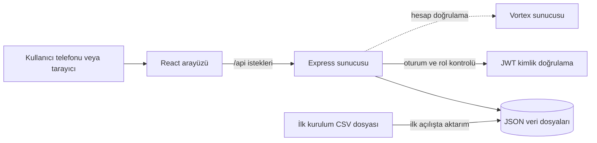

# TPPlaka

<p align="center">
	
</p>

<p align="center">
	Yetkili kullanıcılar için plaka sorgulama ve site filo takibi.
</p>

<p align="center">
	<a href="#kurulum">Kurulum</a> ·
	<a href="#nasıl-çalışır">Nasıl çalışır?</a> ·
	<a href="#son-kullanıcı-rehberi">Son kullanıcı rehberi</a>
</p>

> **Kurumsal durum:** Uygulama arayüzünde ve bu README'de kullanıcı tarafından sağlanan Türk Patent ve Marka Kurumu logosu kullanılır. Bu görsel tek başına kurumun uygulamayı onayladığı, desteklediği veya projeyle resmî iş birliği yaptığı anlamına gelmez. Kurumsal kimlik kullanım izni ayrıca doğrulanmalıdır. Resmî bilgi için [Türk Patent ve Marka Kurumu'nun sitesini](https://www.turkpatent.gov.tr/) ziyaret edin.

## Neler yapar?

- Giriş yapan yetkili kullanıcılar tam ve benzer plaka eşleşmelerini arayabilir.
- Eşleşmede sürücü adı ve plaka gösterilir; kayıtlıysa blok ve daire de gösterilir.
- Yönetici plaka kaydını elle ekleyebilir veya `.xlsx`/`.csv` dosyasından toplu aktarabilir; normal üyeler filo listesini görüntüler.
- PWA olarak Android ve iPhone ana ekranına eklenebilir. Bu, mağazadan indirilen yerel uygulama değil, sunucuya bağlanan bir web uygulamasıdır.

## Nasıl çalışır?



- `client/`: React arayüzü; geliştirme sırasında Vite tarafından sunulur.
- `server/index.js`: Express API'si; güvenlik başlıkları, izinli origin, istek sınırları ve yetki kontrolü uygular. Üretimde derlenmiş arayüzü de sunar.
- `server/db.js`: Başlangıç CSV'sini ve yüklenen isim/plaka kayıtlarını ilk çalıştırmada veya aktarımda `DATA_DIR` içindeki JSON dosyalarına yazar. Sonraki değişiklikler JSON'a yazılır; başlangıç CSV'si otomatik yeniden içe aktarılmaz.
- `server/auth.js` ve `server/vortex.js`: Yerel parola/JWT akışı ile timeout korumalı Vortex hesap bağlantısı.
- `POST /api/plates/import`: Yönetici yetkisiyle 5 MB'a ve 10.000 satıra kadar Excel/CSV aktarımı; yinelenen plakalar atlanıp sonuçta sayılır.
- `server/bootstrap-admin.js`: İlk yönetici hesabını sunucu ortamında bir kez oluşturur. Uygulama içinden kayıt olan kullanıcılar `member` olur.
- `client/public/sw.js`: Arayüz kaynaklarını önbelleğe alır ve uygulama kabuğunu güncel tutar. İsteğe bağlı çevrimdışı kayıt eşitlemesi `VITE_OFFLINE_ENABLED` ile açılır; ayrıntılar için [çevrimdışı kullanım rehberine](docs/offline-mode.md) bakın.

## Kurulum

### Gereksinimler

- Node.js 18.20.x ve npm
- Sunucuya aktarılması için kullanımı yetkilendirilmiş plaka verisi

### Yerel geliştirme

```powershell
npm ci
Copy-Item .env.example .env
New-Item -ItemType Directory -Force data
```

`data/plates.csv` dosyasını oluşturun. CSV'de her satır `plaka;blok;daire` sırasını izlemelidir:

```csv
plaka;blok;daire
06ABC06;C15;3
34XYZ34;A2;12
```

`.env` içinde 32 karakterden uzun, rastgele bir `JWT_SECRET` belirleyin. Yerel geliştirme için `PUBLIC_BASE_URL` ve `CORS_ORIGINS` değerlerini `http://localhost:5173` yapın; `DATA_DIR` değerini `./data` olarak ayarlayın. Vortex kullanmayacaksanız `VORTEX_SERVER_URL` değerini boş bırakın. Vortex kullanacaksanız URL ve auth uçlarını doğrulayın; bağlantı zaman aşımına uğrarsa yerel auth devreye girer.

```powershell
npm run dev
```

Arayüz `http://localhost:5173`, API `http://127.0.0.1:4400` adresindedir. Vite, `/api` isteklerini Express sunucusuna iletir. Üretim modunda sunucu güçlü `JWT_SECRET` ve `CORS_ORIGINS` ister.

### Yönetici hesabı

Yeni kayıtlar yönetici olmaz. İlk yöneticiyi bir kez yerel sunucu terminalinden oluşturun; güçlü parolayı terminal ortam değişkenlerine verin ve komut bitince kaldırın:

```powershell
$env:TPPLAKA_ADMIN_EMAIL = "yonetici@example.com"
$env:TPPLAKA_ADMIN_PASSWORD = "en-az-12-karakterlik-gizli-parola"
npm run bootstrap-admin
Remove-Item Env:TPPLAKA_ADMIN_EMAIL, Env:TPPLAKA_ADMIN_PASSWORD
```

Komut mevcut yöneticiyi gördüğünde çalışmayı reddeder. Üretimde zaten yönetici hesabı varsa bootstrap komutunu yeniden çalıştırmayın.

## Plaka kaydı ve dosyadan aktarım

Yönetici olarak **Filo** sekmesini açın. Tek kayıt girmek için **Yeni plaka ekle** formunda sürücü adı, plaka, blok ve daire alanlarını doldurun. Toplu aktarımda **Excel şablonunu indir** düğmesiyle dosyayı alın, satırları doldurun ve aynı ekrandan yükleyin.

Şablonun ilk sayfasındaki `SÜRÜCÜ AD SOYAD` ve `PLAKA` sütunları zorunludur. `BLOK` ve `DAİRE` sütunları isteğe bağlıdır; konum bilgisi giriliyorsa ikisi birlikte girilmelidir. Elinizdeki `PTS_Abone_Listesi_Excel.xlsx` biçimindeki `SÜRÜCÜ AD SOYAD` ve `PLAKA` sütunları da doğrudan tanınır. Bu dosya özel kişi/plaka verisi içerdiğinden depoya eklenmemeli; yönetici tarafından uygulama içinden seçilmelidir.

Blok ve daire bulunmayan kayıtlarda arama sonucunda sürücü adı ve plaka gösterilir; boş konum alanları kullanıcıya gösterilmez. Aktarım filo/plaka kayıtları oluşturur, uygulama giriş hesabı oluşturmaz. CSV için başlıklı isim/plaka satırları veya eski başlıksız `plaka;blok;daire` biçimi de kabul edilir:

```csv
SÜRÜCÜ AD SOYAD;PLAKA;BLOK;DAİRE
Örnek Sürücü;06ABC06;;
Site Sakini;34XYZ34;A2;12
```

Dosya en fazla 5 MB ve 10.000 kayıt olabilir. Daha önce bulunan plaka tekrar eklenmez; aktarım sonunda eklenen ve yinelenen kayıt sayısı gösterilir. Elle ekleme, şablon indirme ve dosya aktarımı admin yetkisi gerektirir.

### Sunucuya yayınlama

```powershell
npm run build
npm run start:win
```

Express varsayılan olarak `127.0.0.1:4400` üzerinde dinler. Üretimde Nginx yalnızca kendi HTTPS hostundan bu loopback adrese proxy yapmalıdır; `4400` dış dünyaya açılmamalıdır. Sunucuda `DATA_DIR` kalıcı depolama olmalı ve düzenli yedeklenmelidir. JSON depolama nedeniyle tek uygulama örneği çalıştırın. Mevcut VPS servis/deploy akışı için [operasyon rehberine](docs/operations.md) bakın.

Yerel kontroller:

```powershell
npm test
npm run build
```

## Son kullanıcı rehberi

Uygulamayı yöneticinizin paylaştığı HTTPS adresinden açın. Plaka sorgusu ve filo için yetkili hesapla oturum açın. Hesap oluşturabilirsiniz; yeni hesaplar normal kullanıcıdır. Yönetici yetkiniz yoksa filo kayıtlarını yalnızca görüntüleyebilirsiniz.

### Android

1. Bağlantıyı Chrome'da açın.
2. Sağ üstteki üç nokta menüsüne dokunun.
3. **Uygulamayı yükle** veya **Ana ekrana ekle** seçeneğini seçip onaylayın.
4. Ana ekrandaki TPPlaka simgesinden açın.

### iPhone

1. Bağlantıyı Safari'de açın.
2. **Paylaş** düğmesine dokunun.
3. **Ana Ekrana Ekle**'yi seçip **Ekle**'ye dokunun.
4. Ana ekrandaki TPPlaka simgesinden açın.

### Plaka arama ve filo

1. **Hesap** sekmesinden giriş yapın veya hesap açın; ardından **Sorgula** sekmesine geçin.
2. Plakayı yazın. Boşluk kullanmak zorunlu değildir.
3. Eşleşen plakanın blok ve daire bilgisini kontrol edin. Benzer kayıt varsa listeden doğru olanı seçin.
4. Filo listesini görmek için **Filo** sekmesini açın. Kayıt ekleme/silme yalnızca yönetici yetkisine açıktır; erişim gerekiyorsa site yöneticisine başvurun.

Ana ekrana eklemek tek başına kayıtları çevrimdışı yapmaz. Yapılandırma açıksa kullanıcı önce aynı cihazda online giriş yapıp verileri eşitlemelidir; sonrasında arama ve filo listesi salt okunur çevrimdışı kullanılabilir. Kullanıcı adımları için [çevrimdışı kullanım rehberine](docs/offline-mode.md) ve [detaylı kullanım kılavuzuna](Türk%20Paten%20Araba%20Takip%20Uygulamsı/README.md) bakın.

## Güvenlik ve veri

- Yönetici hesabı sadece `npm run bootstrap-admin` ile sunucudan oluşturulur; kayıt formu yönetici yetkisi vermez.
- `JWT_SECRET` için uzun, rastgele ve gizli bir değer kullanın. `.env` dosyasını veya sırları GitHub'a yüklemeyin.
- Sürücü adı, plaka, blok ve daire verileri kişisel/site bilgisi içerebilir. Yalnızca işleme yetkiniz olan veriyi kullanın; gerçek Excel/CSV dosyalarını GitHub'a eklemeyin, erişimi sınırlayın ve yedekleri koruyun.
- Mevcut CSV ilk başlangıç verisidir. JSON dosyaları oluşturulduktan sonra CSV düzenlemek kayıtları güncellemez.

## Proje ve kurum bilgisi

Ana uygulama, tarayıcı sekmesi ve Android/iPhone ana ekran logosu [`client/public/turkpatenetanalogo.jpg`](client/public/turkpatenetanalogo.jpg) dosyasıdır. Uygulamada özgün kare görsel kullanılır; kırpma veya esnetme yapılmaz.
